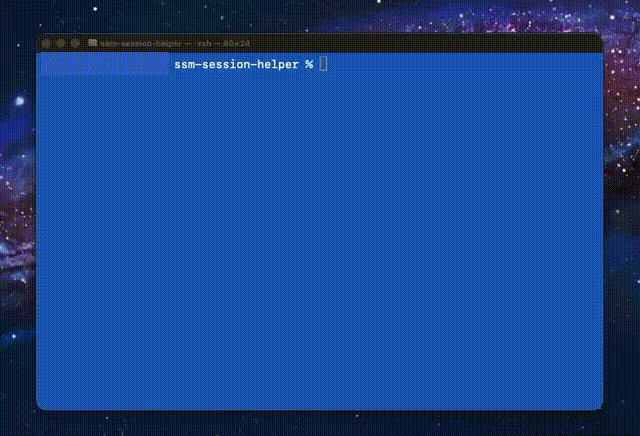
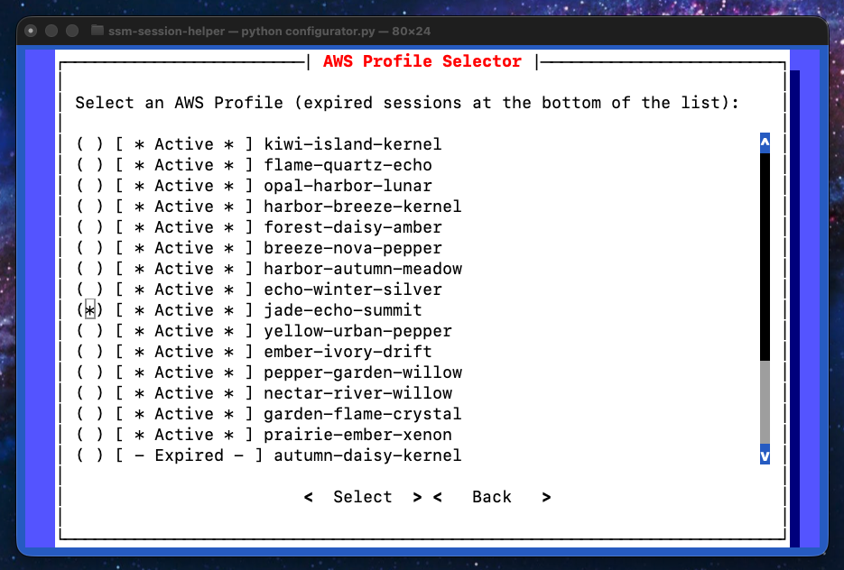
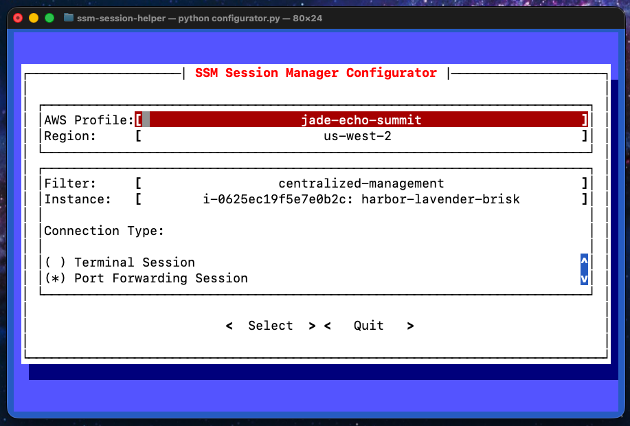
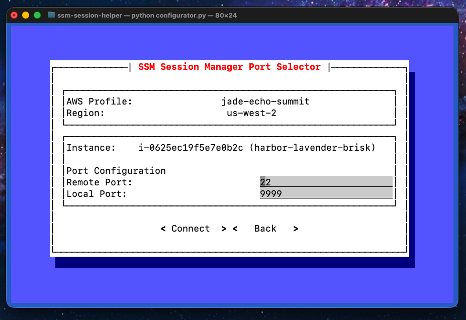
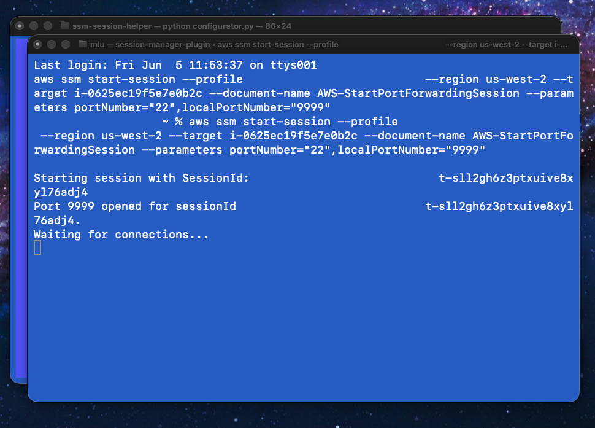

# SSM SessionManager Helper

SSM SessionManager Helper is a tool that helps configure SSM Session Manager [port-forwarded sessions](https://docs.aws.amazon.com/systems-manager/latest/userguide/session-manager-working-with-sessions-start.html). The SSM SessionManager Helper simplifies the connection process by allowing you to select the account, region and instance to connect to without having to navigate to the AWS Web console to find the instance id.

 

The Session Helper leverages the AWS CLI, boto3 and the AWS Session Manager Plugin to create a port-forwarded tunnel through SSM Session Manager to your local machine.

## Requirements

1. Python 3.6 or later
1. [AWS CLI](https://docs.aws.amazon.com/cli/latest/userguide/getting-started-install.html)
1. [AWS Session Manager plugin](https://docs.aws.amazon.com/systems-manager/latest/userguide/session-manager-working-with-install-plugin.html)


## Installation

1. Call `pip install -r requirements.txt`

## Running The SSM SessionManager Helper

1. Call `python configurator.py`
1. Select an active profile
    
    
1. From the configurator dialog, select the desired profile, region and instance by clicking on the appropriate field
    
    

1. Specify the remote port and local port for the connection
1. Click `Connect`
1. Confirm the connection details

    

1. The SSM SessionManager Helper will close and call start an ssm session with the provided details

    

    * `aws ssm start-session` will be called to initialize a session
    * `Waiting for connections` will appear when the session is created

## IAM Role/User Permissions

This script will make the following boto3 calls:

1. ssm start_session
1. ec2 describe_instances 

The role that is assumed by the user of this script must be configured to allow the above boto3 calls to execute. 

A permissive policy that permits the necessary actions for the above boto3 calls would be as follows (it is very important that when implementing this in your account, do __NOT__ use '*' resources in your policies):

```
{
    "Version": "2012-10-17",
    "Statement": [
        {
            "Effect": "Allow",
            "Action": [
                "ssm:StartSession"
            ],
            "Resource": "*"
        },
        {
            "Effect": "Allow",
            "Action": [
                "ssm:DescribeSessions",
                "ssm:GetConnectionStatus",
                "ssm:DescribeInstanceProperties",
                "ec2:DescribeSecurityGroups",
                "ec2:DescribeInstances"
            ],
            "Resource": "*"
        },
        {
            "Effect": "Allow",
            "Action": [
                "kms:GenerateDataKey"
            ],
            "Resource": "*"
        }
    ]
}
```

More details on restricting access to SSM by resource and tag values can be found in the SSM Systems Manager [documentation](https://docs.aws.amazon.com/systems-manager/latest/userguide/getting-started-restrict-access-quickstart.html).

## Further Reading

1. [SSM SessionManager Helper: How It Works](docs/how_it_works.md) - a deeper dive into how this script works
1. [SSM SessionManager Helper: Future Enhancements](docs/future_enhancements.md) - a list of how this script can be enhanced in the future
1. [Sample IAM policies for Session Manager](https://docs.aws.amazon.com/systems-manager/latest/userguide/getting-started-restrict-access-quickstart.html) - official AWS documentation about restricting user access to SSM resources
1. [Port Forwarding Using AWS System Manager Session Manager](https://aws.amazon.com/blogs/aws/new-port-forwarding-using-aws-system-manager-sessions-manager/) - a blog post about how port forwarding works with AWS Session Manager
1. [Python Prompt Toolkit 3.0](https://python-prompt-toolkit.readthedocs.io/en/master/) - the toolkit used to implement the UI for the SSM SessionManager Helper