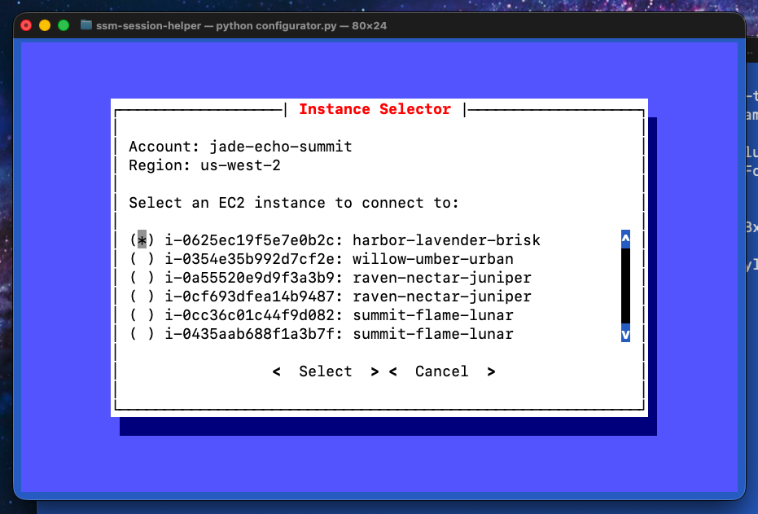

# Future Enhancements

This document outlines areas for future enhancement to the Configurator tool

## Implement logic to parse AWS Credentials files using ConfigParser python library

The logic to parse the AWS Credentials file is currently implemented by reading the file and parsing it textually. AWS Credentials files are configparser compatible and can be read as such.

Refactor the logic to read the AWS Credentials file using the Python configparser library

## Implement Flow to Prompt User To Close Open SSM Sessions on Exit

Present the user with a dialog that prompts them if the want to close opened ssm sessions when the tool exits.

The wording could be "Quit opened ssm sessions?"

Default value should be "No"

Optionally have this set as a value in settings file like: "close_sessions_on_exit": [True, False]

## Implement Filter in Instance Selector Screen

Add a field that allows the user to filter instances in the instance selector screen.

The instance list should dynamically change as the user types partial strings.

## Improve Error Handling

Improve or implement error handling for boto3 calls and in the event that aws profile session tokens expire while the Configurator is running

## Implement an Executable for Configurator

Create a way for this command to be executed from command line without explicitly calling `python configurator.py`.

## Implement Custom Button To Scroll Through Items

Currently, users must click on the profile, region and instance buttons in the configurator to bring up another dialog to select the available options.

Clicking on the instance id from the the Configurator dialog...

... brings up the instance selector dialog

Implementing a custom button to allow users to scroll through instance, profile and region names, rather than having them click through a dialog may improve the user experience.

Clicking on the field, or hitting enter while the field is in focus should still bring up the selector dialog.

